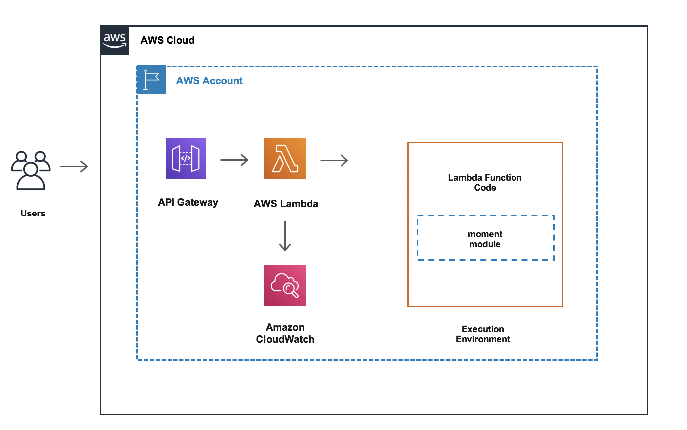
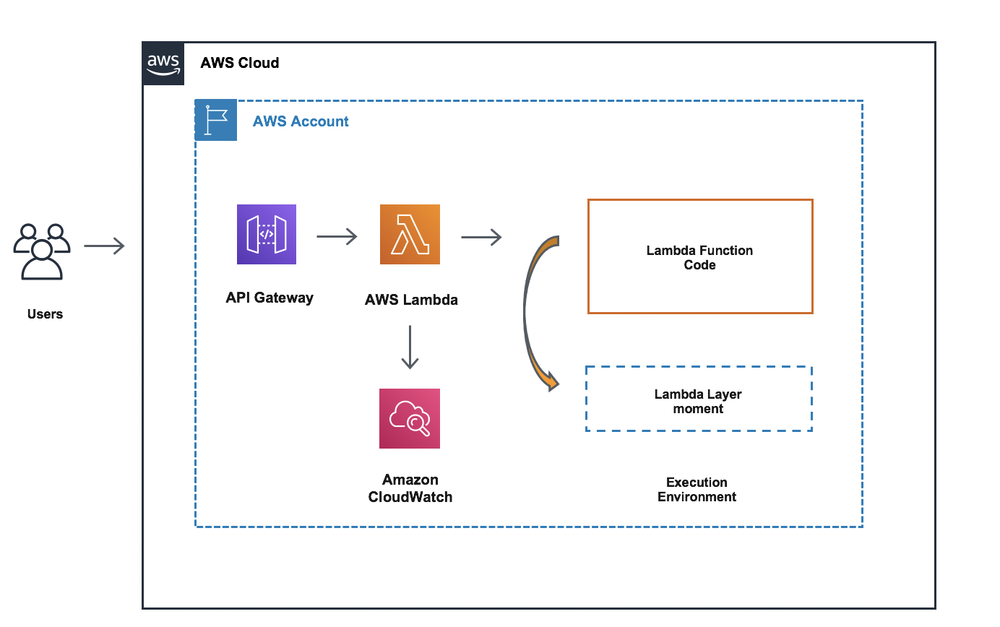

## Develop & Deploy AWS Lambda Layers using Serverless Framework

## Table of contents
1. [Install Serverless Framework](#install)
2. [Create a Serverless project](#create)
3. [Create a Lambda Function](#function)
4. [Deploy the Lambda Function](#deploy)
5. [Test the Lambda Function](#test)
6. [Exclude the node_modules from Lambda Function](#exclude)
7. [Deploy Lambda Function again](#deployagain)
8. [Create Lambda Layer Serverless Project](#layer)
9. [Modify Lambda Function to use Lambda Layer](#modify)
10. [Cleanup](#cleanup)
<hr />

[Serverless Framework](https://www.serverless.com/open-source/) Open Source lets you develop and deploy serverless applications to AWS. The Serverless Framework CLI is the simplest way to develop infinitely scalable, pay-per-execution serverless applications. Following the AWS best practices, we will handle our application and the layers into two independent Serverless projects called:
* lambda-service (will contain the Node function source code)
* lambda-layer (will contain the lambda layers)

### 1. Install Serverless Framework<a name="install"></a>
Install AWS Cloud9 Environment using the instructions [here.](https://docs.aws.amazon.com/cloud9/latest/user-guide/create-environment-main.html)


Inside AWS Cloud9 environment, open a shell terminal and run the following:
```yaml 
npm install -g npm
npm i -g serverless
sls create --help
```

### 2. Create a Serverless project<a name="create"></a>

```yaml
mkdir serverless
cd serverless
sls create -t aws-nodejs -n lambda-service -p lambda-service
```

### 3. Create a Lambda Function<a name="function"></a>



Replace handler.js with:

```js
'use strict';
const moment = require("moment");
const dateNow = moment().format("MMM Do YY");

module.exports.hello = async event => {
  return {
    statusCode: 200,
    body: JSON.stringify(
      {
        message: dateNow
      }),
  };
};
```
Install the moment module.
```yaml
cd lambda-service
npm init -y
npm i moment --save
```
Open serverless.yml under lambda-service and replace it with:

```yaml
service: lambda-service

provider:
  name: aws
  runtime: nodejs12.x
  stage: dev
  region: us-east-1
  profile: default         

functions:
  hello:
    handler: handler.hello
    events:
      - http:
          method: get
          path: hello
```
### 4. Deploy the Lambda Function<a name="deploy"></a>
Inside the lambda-service directory, run the following commands:
```yaml
sls package
sls deploy
```
### 5. Test the Lambda Function<a name="test"></a>

Open the http api gateway endpoint in the browser, and the REST Api will return the current date in the `MMM Do YY` format.

### 6. Exclude the node_modules from Lambda Function<a name="exclude"></a>
Replace the `service: lambda-service` with the following code inside  serverless.yml file:
```yaml
service: lambda-service
package:
  exclude:
    - node_modules/**
```
### 7. Deploy Lambda Function again<a name="deployagain"></a>
```yaml
sls package
sls deploy
```
### 8. Test the Lambda Function again

Open the http api gateway endpoint in the browser, and this time you will get `internal error`.

### 9. Create Lambda Layer Serverless Project<a name="layer"></a>


Inside the `serverless` directory, run the following commands:
```yaml
sls create -t aws-nodejs -n lambda-layer -p lambda-layer
```

Replace the contents of serverless.yml under lambda-layer as:

```yaml
service: lambda-layer

provider:
  name: aws
  runtime: nodejs12.x
  stage: dev
  region: us-east-1
  profile : default         

layers:
  MomentLayer:
    path: moment_layer
    description: "Moment Dependencies"
```
### 10. Create and deploy Lambda Layer 


Open a shell prompt under lambda-layer directory
```yaml
mkdir moment_layer && cd moment_layer
npm init -y
npm i moment --save
cd ../
sls package
sls deploy
```
Note down the AWS urn of the lambda layer that gets created.

### 11. Modify Lambda Function to use Lambda Layer<a name="modify"></a>

Open serverless.yml under lambda-service directory.

Replace it with:

```yaml
service: lambda-service
package:
  exclude:
    - node_modules/**

provider:
  name: aws
  runtime: nodejs12.x
  stage: dev
  region: us-east-1
  profile: default         

functions:
  hello:
    handler: handler.hello
    events:
      - http:
          method: get
          path: hello
    environment:
      NODE_PATH: "./:/opt/node_modules"
    layers:
      - arn:aws:lambda:us-east-1:xxxxxxxxxxx:layer:MomentLayer:1
```
Replace the ARN of lambda layer created in previous step.

### 12. Redeploy the Lambda Function
Open shell prompt in  `lambda-service` directory

```yaml
sls package
sls deploy
```
### 13. Retest the Lambda Fucntion

Open the http api gateway endpoint in the browser, and the REST Api will return the current date in the `MMM Do YY` format.

### 14. Cleanup<a name="cleanup"></a>
Inside the `lambda-service` directory, run:
```yaml
sls remove
```
Inside the `lambda-layer` directory, run:
```yaml
sls remove
```
Finally using the AWS Management Console, remove the AWS CLoud9 environment.

## Security

See [CONTRIBUTING](CONTRIBUTING.md#security-issue-notifications) for more information.

## License

This library is licensed under the MIT-0 License. See the LICENSE file.
